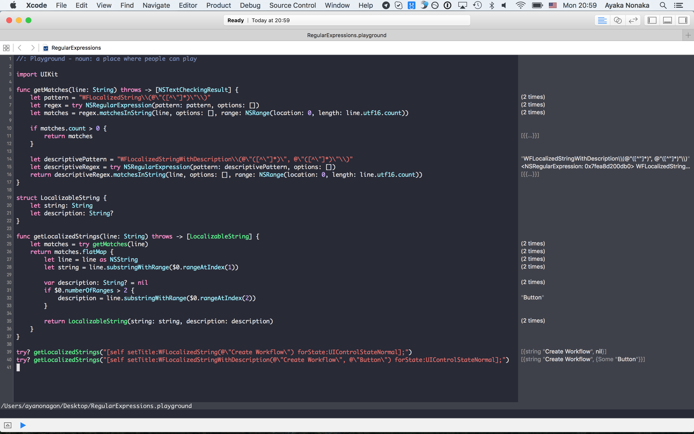
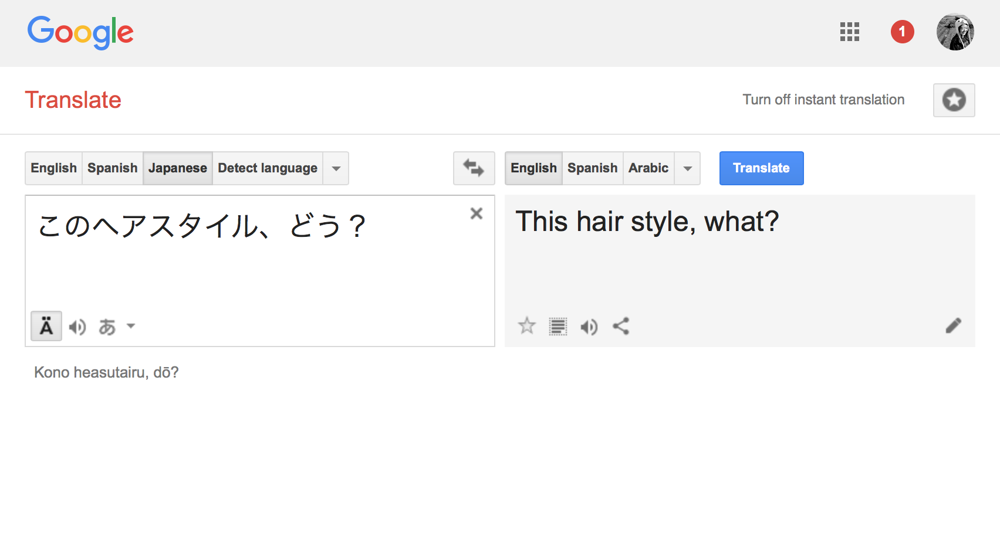
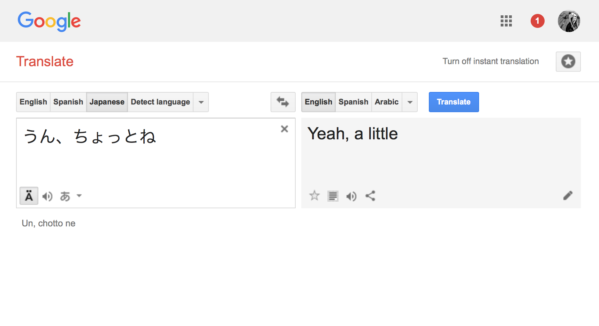
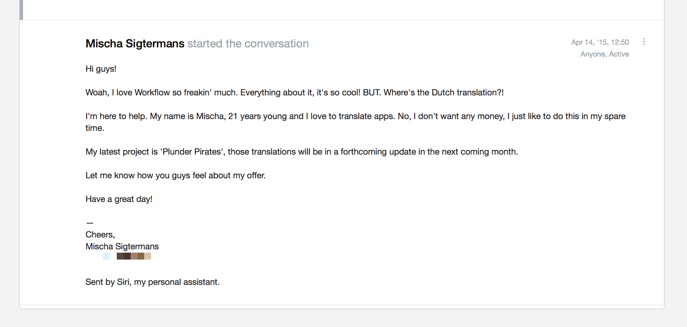
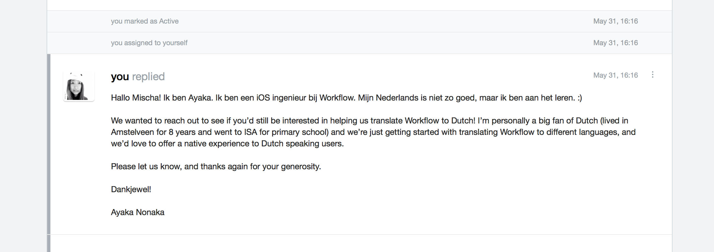
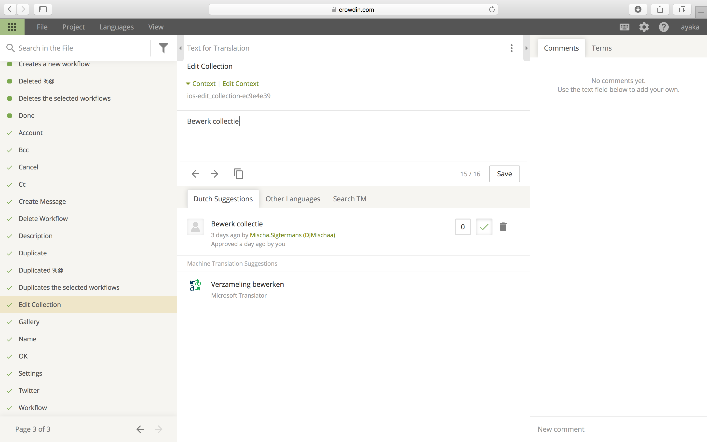

build-lists: true

---

## _**Hi! I’m Ayaka.**_
### *@ayanonagon*


^ Hi everyone! I’m Ayaka. I am so excited to be here today. The first time ever that I was in San Francisco for WWDC was in 2013, and I went to like all of the AltConf sessions. I can’t believe I’m now giving a talk here! Thanks for having me here.

---

# *Workflow*


^ About 5 weeks ago (maybe exactly 5?) I joined the team that builds Workflow. One of the most fun things I’ve worked on has been localization, and in particular, using Swift to help us achieve that. And that’s what I’d like to talk about today.

---

# Swift **Scripting**
## *Localization*
### **AltConf 2016**

^ And in particular, I want to focus on the scripting part. But before we dive in, why do we even care about localization?

---

## _Germany_
## _China_
## _Japan_


^ Well outside of the US, we have the most users in Germany, China, and Japan. And we’ve gotten a lot of requests to bring Workflow to their respective languages. And if you look at the numbers...

---

# [fit] English = > 300 Million Native Speakers

---

# [fit] Spanish = > 400 Million Native Speakers

---

# [fit] Chinese = > 1.3 *Billion* Native Speakers

---

## More potential users :globe_with_meridians:

---

## More users :family:

---

## More profit :moneybag:

---

## More money to put back into your product :moneybag:📲

---

# [fit] Happy long-term users :tada:

---

## `NSLocalizedString`

^ NSLocalizedString allows us to specify which strings in our app should be localized because not all strings are localized. For example, you wouldn’t want to localize a string that you pass to an NSURL or a unique identifier for an object.

---

# MyClass.swift

```swift
let okButtonTitle = NSLocalizedString("OK", comment: "Alert button confirmation title")
let cancelButtonTitle = NSLocalizedstring("Cancel", comment: "Alert button cancel title")
```

^ A localized class might have some lines like this.

---

```sh
$ genstrings *.swift
```

^ And there’s a handy command that you can run to generate the localizable strings file.

---

# Base.lproj/Localizable.strings

```c
/* Alert button confirmation title */
"OK" = "OK";

/* Alert button cancel title */
"Cancel" = "Cancel";
```

^ A localizable string file looks like this. The idea is that you can have one Localizable.strings file for each language that you are localizing to.

---

# nl.lproj/Localizable.strings

```c
/* Alert button confirmation title */
"OK" = "OK";

/* Alert button cancel title */
"Cancel" = "Annuleer";
```

---

# jp.lproj/Localizable.strings

```c
/* Alert button confirmation title */
"OK" = "OK";

/* Alert button cancel title */
"Cancel" = "キャンセル";
```

^ Cool! Are we done now? Well not really. As it turns out, languages are hard. Take this for example.

---

# [fit] _**“Run”**_

^ “Run” is a very versatile word in the English language.

---

# [fit] _**“Run a Workflow”**_

^ You can use to say “Run a Workflow” in the Workflow app. With the same meaning as run a program.

---

# [fit] _**“Run a marathon”**_

^ Or you can say something completely different, like run a program.

---

# [fit] _**“Run a Workflow”**_
# [fit] _**“Run a marathon”**_

^ In both cases, we can use the word Run.

---

# [fit] _**「Workflowを実行する」**_
# [fit] _**「マラソンを走る」**_

^ But in Japanese, those two cases use completely different words.

---

# [fit] 実行
## vs
# [fit] 走る

^ So what do we do?

---

```swift
let runWorkflowTitle = NSLocalizedString("Run", comment: "Run workflow title")
```

```c
/* Run workflow title */
"Run" = "Run";
```

^ First, we can be descriptive in the localized string comment. We can specify that it’s for running a workflow. And when you run genstrings, the comment will be added in the Localizable.strings file as well.

---

```swift
let goOnARunTitle = NSLocalizedString("Run", comment: "Go on a run title")
```

```c
/* Go on a run title */
"Run" = "Run";
```

^ And for the going for a run title, we can also provide a comment, and it’ll get added as a comment in the Localizable.strings file.

---

```swift
let runWorkflowTitle = NSLocalizedString("Run", comment: "Run workflow title")
let goOnARunTitle = NSLocalizedString("Run", comment: "Go on a run title")
```

```c
/* Run workflow title */
"Run" = "Run";

/* Go on a run title */
"Run" = "Run";
```

^ But we have a slight problem here. These both have the same keys. And according to the docs, genstrings requires all keys to be unique in a given .strings file. So this is what a lot of us developers do.

---

```c
/* Run workflow title */
"run-workflow.button.title" = "Run";

/* Go on a run title */
"go-on-a-run.button.title" = "Run";
```

^ We change the key to be a little more descriptive.

---

```c
/* Run workflow title */
"RUN_WORKFLOW_BUTTON_TITLE" = "Run";

/* Go on a run title */
"GO_ON_A_RUN_BUTTON_TITLE" = "Run";
```

^ You might have also seen keys like this. I’ve personally used this format as well.

---

```c
/* Run workflow title */
"RUN_WORKFLOW_BUTTON_TITLE" = "実行";

/* Go on a run title */
"GO_ON_A_RUN_BUTTON_TITLE" = "走る";
```

^ And then we can localize them to other languages like Japanese and have different entries for each “Run” case. But that means that we need to used NSLocalizedString like this.

---

```swift
NSLocalizedString("RUN_WORKFLOW_BUTTON_TITLE", comment: "Run workflow title")
NSLocalizedString("GO_ON_A_RUN_BUTTON_TITLE", comment: "Go on a run title")
```

^ Feels a little redundant.
^ Let’s make it as easy as possible.

---

```swift
NSLocalizedString("Run", comment: "Run workflow title")
NSLocalizedString("Run", comment: "Go on a run title")
```

---

```c
/* Run workflow title */
"Run" = "Run";

/* Go on a run title */
"Run" = "Run";
```

---

```c
/* Run workflow title */
"run-run_workflow_title" = "Run";

/* Go on a run title */
"run-go_on_a_run_title" = "Run";
```

---


```swift
NSLocalizedString("Run", comment: "Run workflow title")
NSLocalizedString("Run", comment: "Go on a run title")
```

```c
/* Run workflow title */
"run-run_workflow_title" = "Run";

/* Go on a run title */
"run-go_on_a_run_title" = "Run";
```

---

### *Goal #1:*
# **Effortless**
# [fit] _NSLocalizedString-ing_

---

### *Goal #2:*
# [fit] Continuous
# [fit] *Localization*

---

# [fit] Fetch Localizable.strings
# [fit] from the *:cloud:*

---

# Goals

1. *Effortless NSLocalizedString-ing* via autogenerating localization keys from comments
2. *Continuous localization* via loading strings from the *:cloud:*

---

~~`NSLocalizedString`~~

`WFLocalizedString`

---

# [fit] `$ genstrings -o en.lproj -s WFLocalizedString`

---

# [fit] ~~`$ genstrings -o en.lproj -s WFLocalizedString`~~

---

# [fit] **Script** *it*

---

# [fit] *In Swift* ♥


---

# Why Swift?

1. Familiar
2. Or new!
3. Fewer language dependencies
4. Type-safe
5. But still feels light-weight & script friendly
6. Fun!

---

# The Plan

1. Get all the `.swift`, `.m`, `.mm` files
2. Parse out all of the `WFLocalizedString`s from each file
3. Write them all out to `Localizable.strings`

---

# [fit] String *Parsing*

---

```objc
[self setTitle:WFLocalizedString(@"Create Workflow")
      forState:UIControlStateNormal];

[self setTitle:WFLocalizedStringWithDescription(@"Create Workflow", @"Button")
      forState:UIControlStateNormal];
```

---

# [fit] *Regular*
# [fit] *Expressions* :scream:

---

# [fit] NS*Regular*
# [fit] *Expressions* :scream: :scream:

---

_`"WFLocalizedString\\(@\"([^\"]*)\"\\)"`_

---

_`"WFLocalizedStringWithDescription\\(@\"([^\"]*)\", @\"([^\"]*)\"\\)"`_

^ Some people live and breath regular expressions. I choke on it.

---

```swift
func getMatches(in line: String) throws -> [TextCheckingResult] {
    let pattern = "WFLocalizedString\\(@\"([^\"]*)\"\\)"
    let regex = try RegularExpression(pattern: pattern, options: [])
    let matches = regex.matches(in: line, options: [], range: NSRange(location: 0, length: line.utf16.count))

    if matches.count > 0 {
        return matches
    }

    let descriptivePattern = "WFLocalizedStringWithDescription\\(@\"([^\"]*)\", @\"([^\"]*)\"\\)"
    let descriptiveRegex = try RegularExpression(pattern: descriptivePattern, options: [])
    return descriptiveRegex.matches(in: line, options: [], range: NSRange(location: 0, length: line.utf16.count))
}
```

---

```swift
struct LocalizedString {
    let string: String
    let description: String?
}

func getLocalizedStrings(in line: String) throws -> [LocalizedString] {
    let matches = try getMatches(in: line)
    return matches.map {
        let line = line as NSString
        let string = line.substring(with: $0.range(at: 1))

        var description: String? = nil
        if $0.numberOfRanges > 2 {
            description = line.substring(with: $0.range(at: 2))
        }

        return LocalizedString(string: string, description: description)
    }
}
```

---

# [fit] *Playgrounds*
# [fit] to the rescue!

---

# [fit] Demo



---

# **Script?**

---

# hello-world.swift

```swift
print("Hello AltConf 2016!")
```

---

### xcrun swift hello-world.swift

---

### chmod +x hello-world.swift

---

### #!/usr/bin/env xcrun swift

---

# hello-world.swift

```swift
#!/usr/bin/env xcrun swift

print("Hello AltConf 2016!")
```

---

### ./hello-world.swift

---

# [fit] Demo

---

### What now?

---

# **Translation**

---

# *Less* **Scriptable**

---

# **But lots of fun!**

---

# [fit] *People* are great
# [fit] with *nuances*

---

# [fit] *このヘアスタイル、どう？*
### (What do you think of this hairstyle?)

---



---

# [fit] *このヘアスタイル、どう？*
### (What do you think of this hairstyle?)

---

# [fit] *うん、ちょっとね…*
### (Yeah, a little…)

---



---

# [fit] *うん、ちょっとね…*
### ((That’s really bad. You should go back to the hair salon and have it fixed.))

---

# [fit] _**Who are the best localizers?**_

---

# [fit] _**Who understands your product the most?**_

---

# Users!

---



---



---



---

### **Script** the *tedious* parts.
### **Focus** on the *nuanced* parts.

---

# Tips

* Make all user facing strings an `NSLocalizedString` even if you don’t have plans to localize the app in the nearest future.
* Avoid using spaces for layout padding like `@"   OK"`
* Avoid concatenating strings to make sentences.

---

# More Reading

* [Apple’s iOS Developer Library: Localizing Your App](https://developer.apple.com/library/ios/documentation/MacOSX/Conceptual/BPInternational/LocalizingYourApp/LocalizingYourApp.html#//apple_ref/doc/uid/10000171i-CH5-SW1)
* [objc.io Issue 9: String Localization](https://www.objc.io/issues/9-strings/string-localization/)
* [My Swift Summit London talk](https://realm.io/news/swift-scripting/)

---

# Cool Projects & Inspiration

* [SwiftGen by AliSoftware](https://github.com/AliSoftware/SwiftGen)
* [twine by mobiata](https://github.com/mobiata/twine)

---

### github.com/*ayanonagon/talks*

---

# [fit] _**Thank you!**_
### ??? *@ayanonagon*


---
