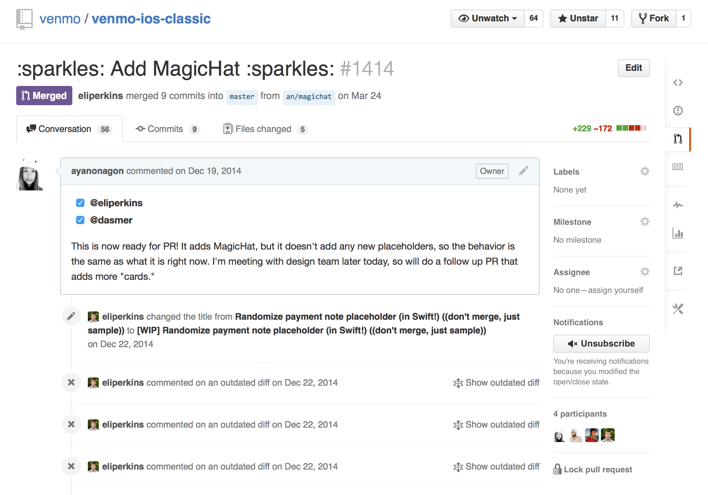

## Why _**Swift**_? for everyone else **&** _so much more_
#### NSSpain 2015 :hatching_chick:

^ How did you convince your company to let you write Swift and have the entire iOS team working on it for 2 months?!

---

## **Hi! I’m Ayaka.**
#### @ayanonagon

---

^ I currently lead the iOS team at Venmo, where I’ve been for a little over 2 years now. I’ve been doing iOS development since iOS 4, and I’ve been really enjoying it since then. Today I want to tell you something that’s a bit crazy.

---

### We rewrote our entire app in Swift.

^ We rewrote our entire app from the ground up in Swift.

---

* 8 weeks
* 5 iOS Engineers

^ We had our entire iOS team working on this rewrite for 8 weeks straight and basically nothing else.

---

# venmo-ios-classic

* > 66,000 lines of Objective-C
* 2011

^ Our old codebase that we now call `venmo-ios-classic` had over 66,000 lines of Objective-C code dating all the way back to 2011. If I had to compare it to something, it would be a very hollow Jenga tower that might fall over with the next block that we added.

---

---

^ Honestly, it just got so exhausting and frustrating to work on a codebase that has such an unstable core.

---

# venmo

* 16,000 lines of Swift 2.0
* A lot of new frameworks, like VenmoKit, ContactsKit, and Static

^ I checked this morning, and we have around 16,000 lines of Swift code now in the app code itself, and I’d say that we are 90-95% done. I was shocked to see the line number difference, but we pulled out a bunch of things in separate frameworks which helped a fair bit. I think this is super awesome, and there’s a lot to talk about here. But the first question that people usually ask us is...

---

## Why _**Swift**_? for everyone else **&** _so much more_
#### NSSpain 2015 :hatching_chick:

^ And that’s what we’re going to talk about today. I titled this talk Why Swift? for everyone else and so much more, because I think a lot of the concepts we’re going to go over are applicable to other situations too where you’re trying to convince your team to start doing something.

---

> How do I get what I want?

^ Another title for this talk could have been, "How do I get what I want?" Maybe you were inspired from some of the other talks this week and

---

## Continuous Integration

^ You want to spend some time on a great CI set up and the tooling that goes around it

---

## Accessibility

^ Maybe you realized on Wednesday that your app is incredibly inaccessible, and want to convince the rest of your team that it’s something worth investing some time in.

---

## watchOS 2 app

^ Or maybe you just want to build something cool that you think your users would love, like a watchOS 2 app.

---

# **Why?**

^ Before trying to convice someone, it really helps to think about why you even want what you want.

---

### **Why** do we want to write _**Swift**_ in the first place?

^ Why do we want to Swift in the first place?

---

# More predictable and safer

* Type-safety
* Immutability & strict compiler
* Nicer syntax

^ I can think of a few things. Swift offers great type-safety, and allows us to rely on immutability and a strict compiler for writing more predictable code. Something that the Objective-C compiler would have let fly, Swift might say no to. I can think of a lot of instances where this would have helped us.

---

### `ABSyncOperation.m`

^ We have this 500 line NSOperation that is probably the scariest piece of code in our entire codebase. It’s not anyone’s fault that it’s scary. It interfaces with the AddressBook framework, which is scary to begin with and it was some of the first code that was written for the app, when Venmo was very much in start-up mode and had to take on some tech-debt to ship things fast. I swear every time we change anything in that class, we release some kind of crash to production.

---

> Thou shall not touch ABSyncOperation.

^ It’s so bad that we joke that our first commandment is thou shall not touch ABSyncOperation. A few months ago we had to add a line of code to this class to get another piece of data from an address book contact. We wrote it, QA’d it, and shipped it. As soon as it hit the App Store, we started getting a crazy number of crashes. It was bad enough that we had to do an expedited release. We looked at Crashlytics, and we were trying to insert a nil value to an NSDictionary.

---

### This wouldn’t even happen in **Swift** because it can’t!

^ A nil value into an NSDictionary?! I’m just like this wouldn’t even happen in Swift because it can’t. Which brings me to another point.

---

### More enjoyable and faster to write

^ This is personal opinion, but based on my experience, it’s a lot of enjoyable, and as as result faster to write because it’s so much more fun. As someone who’s had to help maintain the our current version on the App Store which is our old code while working on the new code, each time I go back, it’s become more and more jarring to read and write Objective-C code. It kind of reminds me of when I first started learning Objective-C back in 2010 and I couldn’t even understand the method syntax and how parameters worked. Don’t get me wrong though, because I don’t want to hate on Objective-C. I used to love it. I used to live and breathe it, even defended it when other developers made fun of it. But now that I’ve seen this new alternative, I feel like there’s no turning back. It’s not you Objective-C, it’s me.

---

# Lyft’s rewrite
> “On the old version, that was a project that took more than a month, with multiple engineers. And with Swift, that was a project that took a week for one engineer.”

---

### Attract great developers

^ Last but not least, I think it’s great for hiring great developers. There aren’t that many companies that have a fully Swift app, or an app that even contains Swift. As Swift becomes more and more the standard, there are going to be more developers looking for this when they’re looking for new jobs, so why not be one of the first ones to support it?

---

# **Why?**

* Write more predictable and safer code
* Make development more enjoyable and faster
* Attract great developers

^ This looks like a great list of reasons, at least for developers. But our goal here is to convice other people on the team, other stakeholders, that it’s worth it. In our case, we have to convince the product team. The PM’s and the designers. So we have to keep asking why. Why do we want to write more predictable and safer code? Maybe to reduce the number of crashes. Why do we care about enjoyable development and hiring people? Because we want to work with great engineers, and also have them stay. But we can go even deeper than that. Why do we want to reduce the number of crashes? Why do we want great engineers?

---

> We want to ship a great product.

^ Keep asking why, and you’ll end up with a common goal. Something that the product team will understand and relate to.

---

### Engineering is a
### **means to an end**

^ After all, engineering is a means to an end, and we’re all trying to make something that our users love. That doesn’t mean you can’t enjoy the journey though. So why not write some Swift and have fun while shipping great products to users?

---

### Tie it to another project

^ Once you have this common goal, it’s a little easier to tie things together. In our case, we knew that we wanted to revamp how navigation works within the app. The current app has a hamburger menu, and our users are clearly confused about how to use the app. We already had a new design that we wanted to implement that would make this a lot better, but it would require us to regut the entire app anyway, and we knew everything would fall apart if we tried to do that. The iOS team thought that this might be a good enough reason for us to do our big rewrite. We decided that with our team size, we’d probably need about a fully dedicated 2 months or so to do this rewrite.

---

> Hey can we just have like 2 months to rewrite our entire app in Swift? :innocent:

^ So, do we just go up to the product team and go, hey can we just have like 2 months to rewrite our entire app in Swift? Cool. K thanks bye.

---

## Make it incremental

^ No, we need to approach it incrementally.

---

### Non-production use

^ We started off with non-production uses of Swift.

---

# Non-production use
* Scripting
* Tests

^ We used to use Ruby and bash for scripting and automating various tasks. I personally am not very good at Ruby or bash, because I don’t use it every day. But one day our team thought, ooh maybe we can start using Swift for this! And so we did. I gave a talk about this at Swift Summit this past March if anyone’s interested in that. I think the recording is on the Swift Summit website. Another thing that we started doing and have seen other teams start doing is writing tests in Swift, even if it’s testing Objective-C code. After we started getting used to Swift, we felt ready to start putting it in our app.

---

### 2. New code in Swift

^ Starting in March, everything new component that we added, we wrote in Swift.

---

^ It started with one small PR.

---

^ Which got a nice juicy green apple, and the rest is history. Swift was introduced into our codebase, and there was no looking back.

---

* Bi-weekly demo

* Make it a part of daily conversation

* Less foreign :alien:

^ Another thing that we tried to do on a side, was to get the team beyond just iOS team to get excited about Swift. We have biweekly demos at our company. We always made sure to show off new features that we added, and we were like BY THE WAY this is written in Swift, and it’s amazing. We’d talk about it during lunch to engineers and PM’s, basically anyone who would talk to us, about how excited we were about this. I think almost the entire Venmo team knows how Swift obsessed our team is. Swift became less of a foreign idea, and more something that is awesome.

---

### 3. Now we want to rewrite the entire app in Swift

^ And now, we wanted to do something bigger. We wanted to write our entire app in Swift.

---

## Making the case

^ So what now? How do we take all of this and propose that we’d like to do this massive rewrite? Well, as an engineer, my first instinct was to go with logic. Kind of like writing a math proof. So I thought about all the things that product people would be concerned about like things in the backlog that they wanted to ship. I found the list of upcoming projects, and basically made a case for each project that it can wait 2 months. Some of the projects were still in exploration, and didn’t seem like it would be ready to build anytime soon. Other projects, we made the case that it would take much much less time if we had a nicer codebase to build on. I made a document and listed these all out. Once that was ready, I got all of the stakeholders in one room, and presented our case, which looked something like...

---

## Logic
## Logic
## Logic
## Logic
## Logic

^ Logic all the things.

---

# QED

^ QED, case closed.

---

# _Airtight_

^ I thought our logic was airtight.

---

# Ridiculous

^ and it would be ridiculous to argue against it

---

# Illogical

^ and simply illogical to do so. I looked around at the room to see what people were thinking and I saw something like this:

---

# :no_mouth: :no_mouth: :no_mouth:
# :no_mouth: :no_mouth: :no_mouth:

^ I was like uhhh so that means we’re good right? We can do this?

---

# :no_mouth:
### _“sure...”_

^ After a brief pause, one of the PM’s said "sure" but with some reluctance.

---

### :coffee: :tea:

^ A couple of days later, my engineering manager and I had our weekly 1-1. I asked him why everyone was so reluctant when we are clearly so excited and motivated to do this. Being the wise engineering manager, he said well, I think they wanted to have a little more input, like they had more of a say in it. I was like "Alright I guess that makes sense. Do you have any tips on what I can do better next time?" He recommended a book to me. It’s called Getting More. So I ordered it on Amazon, and two days later I started reading it. Funny enough, the entire first section was about the fact that we should NOT rely on logic when you’re trying to negotiate with someone.

---

### You might win

^ With logic, you might win.

---

### … but they’ll feel awful :disappointed:

^ But the other party is going to feel awful, like they’ve been cornered with logic.

---

### … and you’ll probably lose next time :scream:

^ Worst of all, you’ll probably lose next time. If you think about it, you’re more likely to work with someone when you feel good working with them.

---

## Ask for _their_ opinions

^ The big thing we did was to ask for their opinions, and of course they listed a bunch of concerns.

---

> What if we miss something?

---

> What about the other projects that are in the backlog?

---

# :rage: :scream: :sob: :unamused: :triumph:

^ Honestly when I first heard those questions, my initial internal reaction was something like this. Ugh we already talked about this!

---

### Fight _or_ Flight
### Defensive

^ I kind of fell into this fight or flight, defensive mode. But before I said anything back, I thought about it more.

---

### Opposing opinions are based in some fact

^ If you think about it, opposing opinions are based in some fact, at least from their perspective.

---

## Take it as an
## :sparkles: opportunity :sparkles:

^ So I put my optimistic hat on. We can take this as an opportunity!

---

> How are we going to make sure we don’t miss anything?

^ So when they asked how are we going to make sure we don’t miss anything? I tried to respond with something like

---

> That’s a great question. Can you help us make sure we don’t miss anything?

---

# Result

* Way better QA plan for release
* More confidence in the rewrite and timeline
* Felt more like we were working together

^ The results were great. We had a way better QA plan for the release because the product team listed out all the edge cases that they were concerned about, and we were able to be a lot more confident in our rewrite. Most importantly, it felt more like we were working together on a shared goal. I’ve been trying to apply this to other situations too. The other week, I made a pull-request, and I was pretty proud of it, so I send it over with some screenshots to one of the PM’s. Then I got a Slack message:

---

> The UI Changed. Can you update it?

---

# :rage:

^ My initial reaction was frustration. No one told me the design changed! And worst of all, the updated design was a lot harder to build, and we were already tight on time with our rewrite. But I remembered, I have to keep calm.

---

# :smirk:

^ I wanted to see if my new negotiation technique would work.

---

> That’s going to be harder to build and take a lot longer.

---

> Is there a middleground that we can reach?

^ I made it clear that I wanted their opinion too. The PM’s response?

---

> “ya, of course”

^ Nice and simple.

---

> “What do you think?”

^ I think just asking something like “What do you think?” can go a long way. It’s useful for other situations too, like code-reviews. Instead of imposing your opinions, you can state your opinions, but also ask for their opinions.

---

### Not _you_ vs. _them_

^ It becomes less you vs them.

---

## Less
### **stress** _&_ **animosity**

^ There’s less stress and animosity that can build up

---

## More
### **happiness** _&_ **collaboration**

---

# Recap

1. Find a shared goal
2. Make it incremental
3. “What do you think?”

^ To recap, if you want to convince someone, you want to find a shared goal. You want to introduce things incrementally, so it’s less of a surprise. And last but not least, try to make “What do you think?” a habit. It’s a small thing, but it makes a huge difference.

---

# Resources

* Fast Company’s article on Lyft’s Swift rewrite
* Getting More by Stuart Diamond
* Stuff coming from our team soon!

^ I want to leave you with one more tip. I was going to say don’t ask for permission.

---

## Don’t ask for permission.

^ But I don’t want to get you in trouble, so I’ll say

---

## Don’t ask for _too_ much permission.

^ Don’t ask for too much permission. When we started writing tools in Swift, we didn’t ask anybody if we could do that. When we started adding Swift to our codebase we didn’t ask anyone. It’s a fine line to figure out when you should ask someone vs not, but when in doubt, I’d err on the side of not asking. What’s the worst that can happen?

---

## Thank you
## **Gracias**

---

# Questions?
### _@ayanonagon_

---
